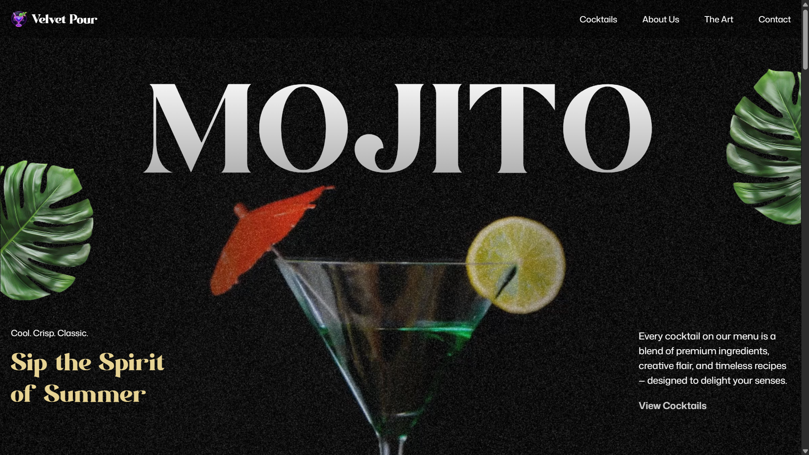

<h1 align="center">
    
</h1>

<p align="center">
  <a href="#-about">About</a>&nbsp;&nbsp;&nbsp;|&nbsp;&nbsp;&nbsp;
  <a href="#-project">Project</a>&nbsp;&nbsp;&nbsp;|&nbsp;&nbsp;&nbsp;
  <a href="#-technologies">Technologies</a>&nbsp;&nbsp;&nbsp;|&nbsp;&nbsp;&nbsp;
  <a href="#-how-to-run">How to run</a>
</p>

<p align="center">
  
</p>

## ⛅ About

Velvet Pour is an immersive landing page created for a premium cocktail brand. Designed to evoke elegance and exclusivity, it leverages motion design and refined aesthetics to engage users and tell a compelling brand story.

## 🚀 Project

🌟 Situation:

Luxury brands require more than static pages, they thrive on immersive digital storytelling. The challenge was to design a scroll-animated landing page that reflects the product's premium identity while maintaining high performance and accessibility.

🎯 Task:

Develop a landing page that:

- Features smooth, high-end animations to captivate the user.
- Offers a clean, responsive layout across all devices.
- Enhances branding through visual storytelling and motion.
- Uses modern technologies for maintainability and scalability.

🚀 Action:

To achieve this, I implemented the following:

- Animation Design: Leveraged GSAP for seamless scroll-triggered animations that enrich the user journey.
- Modern Stack: Utilized React.js with Vite for fast bundling and optimal performance.
- Responsive Styling: Employed Tailwind CSS to ensure consistent design across screen sizes.
- Type Safety: Adopted TypeScript to boost code quality and maintainability.
- Clean Architecture: Organized components in a modular and scalable structure.

🏆Result:

Velvet Pour successfully delivered:

- Immersive Experience: Engaged users through refined motion and storytelling.
- High Performance: Fast-loading and responsive design, even with animations.
- Developer-Friendly Codebase: Type-safe, scalable, and well-structured.
- Premium Aesthetic: Fully aligned with high-end brand identity.

Explore Velvet Pour’s live experience:

<h3 align="center"><a href="https://velvet-pour-menu.vercel.app/" target="_blank">https://velvet-pour-menu.vercel.app/</a> 🍹✨</h3>

## 🔧 Technologies

Throughout these projects, I have utilized a variety of technologies and tools, including:

- [React.js](https://reactjs.org/)
- [TypeScript](https://www.typescriptlang.org/)
- [Tailwind CSS](https://tailwindcss.com/)
- [GSAP](https://gsap.com/)
- [Vite](hhttps://vite.dev/)
- [Vercel](https://vercel.com/)

## 😊 How to run

Before starting, you need to have [Git](https://git-scm.com) and [Node](https://nodejs.org/en/) installed on your machine.

```sh
- Clone this repo:
$ git clone https://github.com/marcelopajr/gsap-cocktails.git

- Enter directory:
$ cd gsap-cocktails

- Install dependencies:
$ npm install

- Launch the app:
$ npm run dev
```

Now the app will be running at: http://localhost:5173 🚀

Enjoy the magic of motion-driven UI! 🍹✨
